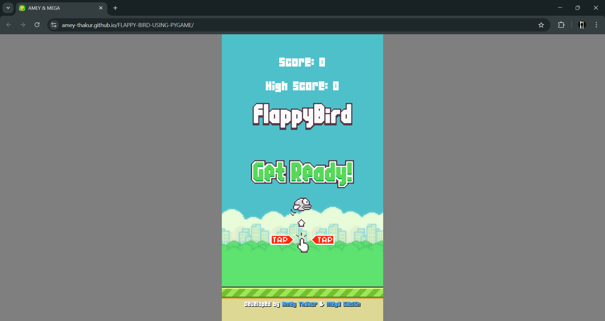
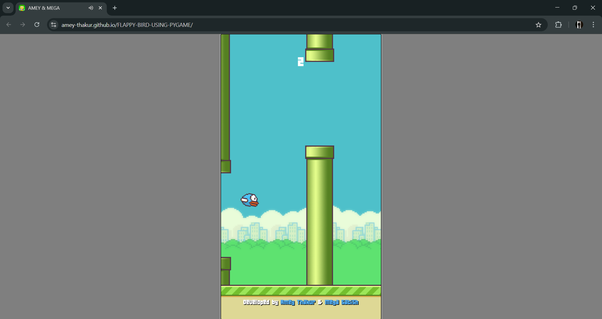
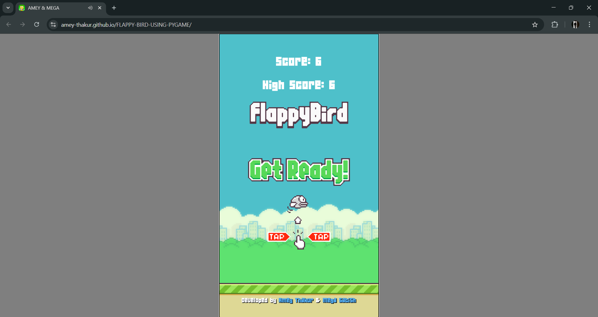
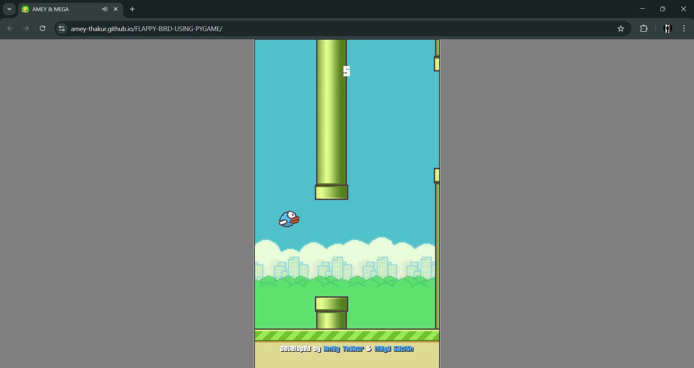
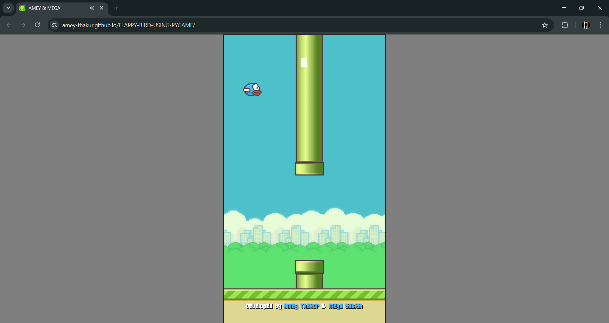

<div align="center">

  <a name="readme-top"></a>
  # Flappy Bird

  [](LICENSE)
  
  [](https://github.com/Amey-Thakur/FLAPPY-BIRD-USING-PYGAME)
  [](https://github.com/Amey-Thakur/FLAPPY-BIRD-USING-PYGAME)

  A high-fidelity **Python** + **Pygame** implementation of the Flappy Bird arcade classic, engineered with pixel-perfect collision physics and a responsive game loop.

  **[Source Code](Source%20Code/)** &nbsp;·&nbsp; **[Technical Specification](docs/SPECIFICATION.md)** &nbsp;·&nbsp; **[Live Demo](https://amey-thakur.github.io/FLAPPY-BIRD-USING-PYGAME/)**

</div>

---

<div align="center">

  [Authors](#authors) &nbsp;·&nbsp; [Overview](#overview) &nbsp;·&nbsp; [Features](#features) &nbsp;·&nbsp; [Structure](#project-structure) &nbsp;·&nbsp; [Results](#results) &nbsp;·&nbsp; [Quick Start](#quick-start) &nbsp;·&nbsp; [Usage Guidelines](#usage-guidelines) &nbsp;·&nbsp; [License](#license) &nbsp;·&nbsp; [About](#about-this-repository) &nbsp;·&nbsp; [Acknowledgments](#acknowledgments)

</div>

---

<!-- AUTHORS -->
<div align="center">

  <a name="authors"></a>
  ## Authors

| <a href="https://github.com/Amey-Thakur"></a><br>[**Amey Thakur**](https://github.com/Amey-Thakur)<br><br>[](https://orcid.org/0000-0001-5644-1575) | <a href="https://github.com/msatmod"></a><br>[**Mega Satish**](https://github.com/msatmod)<br><br>[](https://orcid.org/0000-0002-1844-9557) |
| :---: | :---: |

</div>

> [!IMPORTANT]
> ### 🤝🏻 Special Acknowledgement
> *Special thanks to **[Mega Satish](https://github.com/msatmod)** for her meaningful contributions, guidance, and support that helped shape this work.*

---

<!-- OVERVIEW -->
<a name="overview"></a>
## Overview

**Flappy Bird** is a precision-engineered simulation of the side-scrolling arcade classic, rebuilt using **Python** and **Pygame** with a focus on physics-driven interactive design. By leveraging **Object-Oriented Programming (OOP)**, the engine manages complex state transitions between gravity-induced acceleration and user-triggered momentum, delivering a responsive and challenging study into game loop architecture.

### core mechanics
The simulation is governed by strict **computational design patterns** ensuring fidelity and responsiveness:
*   **Gravity Simulation**: The engine implements a constant downward acceleration vector, countered by high-impulse "flapping" events that calculate instantaneous upward velocity.
*   **Collision Heuristics**: Utilizes pixel-perfect or AABB collision logic to handle high-frequency interactions between the bird sprite and procedurally generated pipe obstacles.
*   **Direct Manipulation**: Input handling supports both continuous key-state (Space) and coordinate-base (Mouse) control schemes, ensuring **zero-latency** response critical for high-frequency gameplay.
*   **Procedural Generation**: Obstacles are spawned with stochastic height variations, ensuring a non-repetitive gameplay loop while maintaining tight performance constraints.

> [!TIP]
> **Sensory Feedback Integration**
>
> To maximize state clarity, the system employs **multi-modal feedback**. Instantaneous audio triggers synchronize with physics events (flap, hit, score). This ensures the user's mental model is constantly synchronized with the underlying game state without reliance on intrusive UI elements.

---

<!-- FEATURES -->
<a name="features"></a>
## Features

| Feature | Description |
|---------|-------------|
| **Physics Engine** | High-precision gravity and momentum calculation for authentic arcade feel. |
| **Procedural Generation**| Dynamic obstacle spawning with variable gap logic for infinite replayability. |
| **Collision Tracking** | Advanced **Sprite Collision Logic** ensuring fair and precise hit detection. |
| **Audio Immersion** | Event-driven sound engine synchronized with physics and scoring events. |
| **State Management** | Modular architecture handling Start, Play, and Game Over transitions. |
| **UI System** | Clean, minimalist interface focusing on core interactive performance. |
| **Responsive Input** | **Multi-modal Input** (Space & Mouse) with zero-latency polling for precise interaction. |

> [!NOTE]
> ### Interactive Polish: The Momentum Singularity
> We have engineered a **Physics-Driven State Manager** that calibrates gravitational pull against vertical impulse to simulate weight. The visual language focuses on the vibrant "8-bit" aesthetic, ensuring maximum focus on the interactive trajectory and timing.

### Tech Stack
- **Languages**: Python 3.11
- **Logic**: **Pygame Engine** (Asynchronous Loop & Physics Engine)
- **Imaging**: **Sprite-Based Rendering** (Optimized Bitmapped Graphics)
- **UI System**: Premium Retro Graphics (Custom Python Canvas)
- **Deployment**: GitHub Actions (CI/CD Build Pipeline)
- **Hosting**: GitHub Pages

---

<!-- STRUCTURE -->
<a name="project-structure"></a>
## Project Structure

```python
FLAPPY-BIRD-USING-PYGAME/
│
├── .github/                         # Deployment & Automation Layer
│   └── workflows/
│       └── main.yml                 # CI/CD Pipeline (Build & Deploy)
│
├── docs/                            # Technical Documentation
│   └── SPECIFICATION.md             # Architecture & Design Specification
│
├── Mega/                            # Archival Attribution Assets
│   ├── Filly.jpg                    # Companion (Filly)
│   └── Mega.png                     # Author Profile Image (Mega Satish)
│
├── screenshots/                     # Project Visualization Gallery
│   ├── 01-landing-state.png         # Main Launch State
│   ├── 02-active-gameplay.png       # Physics & Interaction
│   ├── 03-progressive-score.png     # State Tracking
│   └── 04-high-score-persistence.png # Persistence Layer
│
├── Source Code/                     # Primary Application Layer
│   ├── assets/                      # Visual Assets (Sprites)
│   ├── sound/                       # Audio Assets (WAV/OGG)
│   ├── 04B_19.TTF                   # Game Font
│   ├── favicon.png                  # System Identity Icon
│   └── main.py                      # Core Game Logic (Asynchronous Entry Point)
│
├── .gitattributes                   # Git configuration
├── .gitignore                       # Repository Filters
├── CITATION.cff                     # Scholarly Citation Metadata
├── codemeta.json                    # Machine-Readable Project Metadata
├── LICENSE                          # MIT License Terms
├── README.md                        # Comprehensive Scholarly Entrance
└── SECURITY.md                      # Security Policy & Protocol
```

---

<!-- RESULTS -->
<a name="results"></a>
## Results

<div align="center">
  <b>Main Landing: System Initialization</b>
  <br>
  <i>Initial game state with high-contrast asset loading.</i>
  <br><br>
  
  <br><br><br>

  <b>Active Gameplay: Kinetic Physics</b>
  <br>
  <i>Real-time gravity calculation and impulse-based interaction.</i>
  <br><br>
  
  <br><br><br>

  <b>State Tracking: Score Progression</b>
  <br>
  <i>Procedural obstacle navigation and scoring heuristics.</i>
  <br><br>
  
  <br><br><br>

  <b>Performance Summary: Persistence Layer</b>
  <br>
  <i>High-score record persistence via system-state management.</i>
  <br><br>
  
  <br><br><br>

  <b>Additional Views: Gameplay & Mechanics</b>
  <br>
  <i>Showcasing dynamic obstacle generation.</i>
  <br><br>
  
  
</div>

---

<!-- QUICK START -->
<a name="quick-start"></a>
## Quick Start

### 1. Prerequisites
- **Python 3.11+**: Required for runtime execution. [Download Python](https://www.python.org/downloads/)
- **Git**: For version control and cloning. [Download Git](https://git-scm.com/downloads)

> [!WARNING]
> **Local Execution**
>
> For local development, ensure that the `pygame` library is correctly installed. Running the project locally may require specialized asset handling to ensure path consistency across different operating systems.

### 2. Installation
Clone the repository and install the necessary dependencies:

```bash
# Clone the repository
git clone https://github.com/Amey-Thakur/FLAPPY-BIRD-USING-PYGAME.git
cd FLAPPY-BIRD-USING-PYGAME

# Install Pygame (Community Edition recommended for best performance)
pip install pygame-ce
```

### 3. Execution
Launch the application directly as a high-performance desktop application:
```bash
python "Source Code/main.py"
```

---

<!-- =========================================================================================
                                     USAGE SECTION
     ========================================================================================= -->
## Usage Guidelines

This repository is openly shared to support learning and knowledge exchange across the academic community.

**For Students**  
Use this project as reference material for understanding interactive system design, game development patterns, and Python principles. The source code is available for study to facilitate self-paced learning and exploration of user-centric design patterns.

**For Educators**  
This project may serve as a practical lab example or supplementary teaching resource for Game Development and Python Programming courses. Attribution is appreciated when utilizing content.

**For Researchers**  
The documentation and design approach may provide insights into academic project structuring and interactive application development.

---

<!-- LICENSE -->
<a name="license"></a>
## License

This repository and all its creative and technical assets are made available under the **MIT License**. See the [LICENSE](LICENSE) file for complete terms.

> [!NOTE]
> **Summary**: You are free to share and adapt this content for any purpose, even commercially, as long as you provide appropriate attribution to the original authors.

Copyright © 2021 Amey Thakur & Mega Satish

---

<!-- ABOUT -->
<a name="about-this-repository"></a>
## About This Repository

**Created & Maintained by**: [Amey Thakur](https://github.com/Amey-Thakur) & [Mega Satish](https://github.com/msatmod)  
**Academic Journey**: Bachelor of Engineering in Computer Engineering (2018-2022)  
**Institution**: [Terna Engineering College](https://ternaengg.ac.in/), Navi Mumbai  
**University**: [University of Mumbai](https://mu.ac.in/)

This project features **Flappy Bird**, a high-performance reconstruction of the mobile arcade classic. It represents a personal exploration into **Python**-based game development and interactive physics simulation.

**Connect:** [GitHub](https://github.com/Amey-Thakur) &nbsp;·&nbsp; [LinkedIn](https://www.linkedin.com/in/amey-thakur) &nbsp;·&nbsp; [ORCID](https://orcid.org/0000-0001-5644-1575)

### Acknowledgments

Grateful acknowledgment to [**Mega Satish**](https://github.com/msatmod) for her exceptional collaboration and scholarly partnership during the development of this game design project. Her constant support, technical clarity, and dedication to software quality were instrumental in achieving the system's functional objectives. Learning alongside her was a transformative experience; her thoughtful approach to problem-solving and steady encouragement turned complex requirements into meaningful learning moments. This work reflects the growth and insights gained from our side-by-side academic journey. Thank you, Mega, for everything you shared and taught along the way.

Special thanks to the **mentors and peers** whose encouragement, discussions, and support contributed meaningfully to this learning experience.

---

<div align="center">

  [↑ Back to Top](#readme-top)

  [Authors](#authors) &nbsp;·&nbsp; [Overview](#overview) &nbsp;·&nbsp; [Features](#features) &nbsp;·&nbsp; [Structure](#project-structure) &nbsp;·&nbsp; [Results](#results) &nbsp;·&nbsp; [Quick Start](#quick-start) &nbsp;·&nbsp; [Usage Guidelines](#usage-guidelines) &nbsp;·&nbsp; [License](#license) &nbsp;·&nbsp; [About](#about-this-repository) &nbsp;·&nbsp; [Acknowledgments](#acknowledgments)

  <br>

  🐦 **[FLAPPY-BIRD](https://amey-thakur.github.io/FLAPPY-BIRD-USING-PYGAME)**

  ---

  ### 🎓 [Computer Engineering Repository](https://github.com/Amey-Thakur/COMPUTER-ENGINEERING)

  **Computer Engineering (B.E.) - University of Mumbai**

  *Semester-wise curriculum, laboratories, projects, and academic notes.*

</div>

