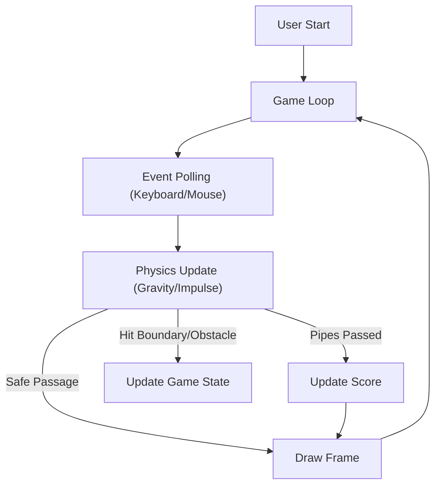

# Technical Specification: Flappy Bird

## Architectural Overview

**Flappy Bird** is a digital implementation of the side-scrolling arcade foundational classic, engineered to demonstrate core game engine mechanics including gravity simulation, collision detection, and procedural generation. The application serves as a digital study into early interactive system architecture, brought to life using Python.

### Game Logic Flow

---

## Technical Implementations

### 1. Engine Architecture
-   **Core**: Built on **Pygame**, utilizing its optimized C-based backend for efficient sprite handling and collision detection.
-   **Loop Management**: Implements a modular synchronous event loop ensuring consistent frame timing and state synchronization.

### 2. Logic & Physics
-   **Collision Detection**: Uses Mask-based collision logic via `pygame.mask` for pixel-perfect interaction between the bird sprite and obstacle surfaces.
-   **Gravity Heuristics**: The engine implements a constant downward acceleration vector with immediate vertical impulse overrides on user input.
-   **Audio Engine**: Event-driven sound triggering synchronized with physics events (flap, crash, goal) to ensure maximum state visibility.

### 3. Deployment Pipeline
-   **CI/CD**: **GitHub Actions** handles the build process, ensuring automated deployment and archival consistency.

---

## Technical Prerequisites

-   **Runtime**: Python 3.11+.
-   **Dependencies**: `pygame`.

---

*Technical Specification | Python | Version 1.0*
