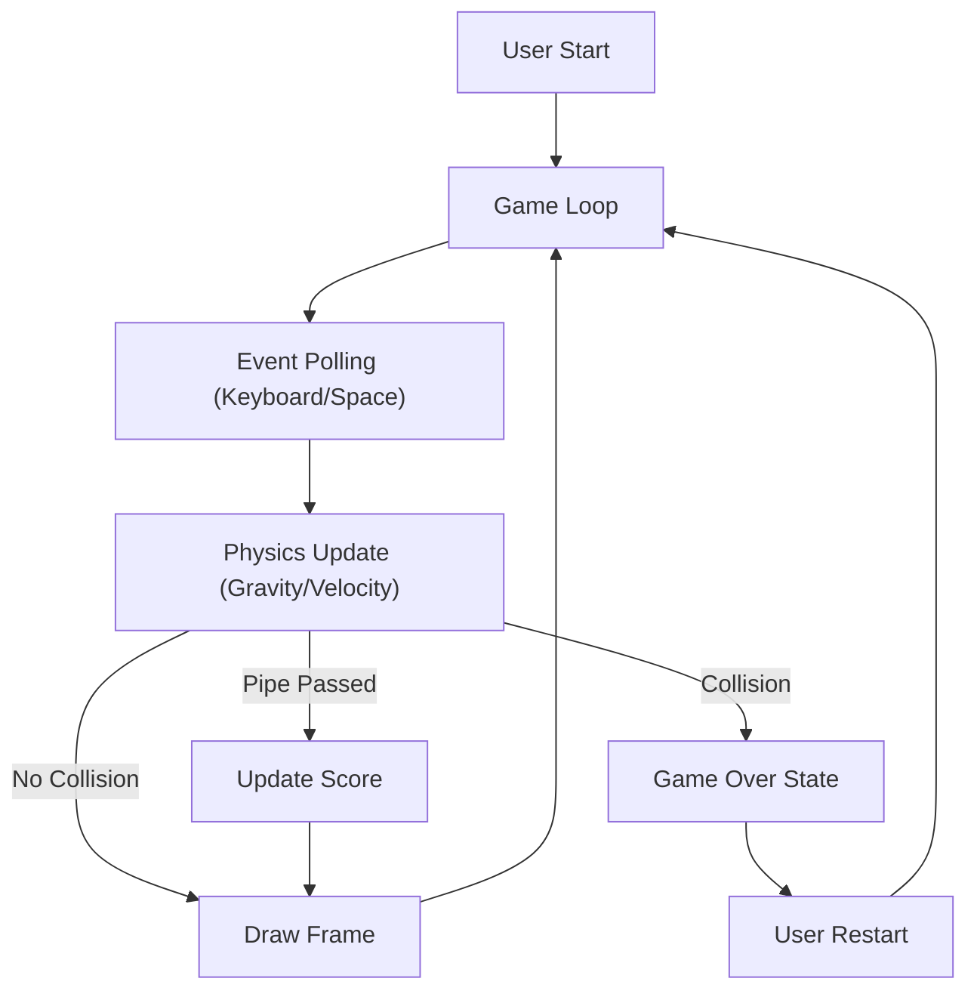

# Technical Specification: Flappy Bird using Pygame

## Architectural Overview

**Flappy Bird** is a digital implementation of the side-scrolling arcade game, designed to demonstrate core game engine mechanics including gravity simulation, collision detection, and procedural generation. The application serves as a digital study into interactive system architecture, brought to life using Python.

### Game Logic Flow

---

## Technical Implementations

### 1. Engine Architecture
-   **Core**: Built on **Pygame**, utilizing its optimized C-based backend for efficient sprite handling and collision detection.
-   **Loop Management**: Implements a standard synchronous event loop ensuring consistent frame timing (`clock.tick`).

### 2. Logic & Physics
-   **Collision Detection**: Uses Mask-based collision logic via `pygame.mask.from_surface` to handle pixel-perfect interactions between the bird and pipes.
-   **Procedural Generation**: Pipes are generated at randomized vertical intervals to create infinite gameplay variety.
-   **Audio Engine**: Event-driven sound triggering synchronized with physics events (flap, score, collision).

### 3. Deployment Pipeline
-   **Source Control**: Managed via GitHub, with strict versioning and preservation protocols.

---

## Technical Prerequisites

-   **Runtime**: Python 3.x.
-   **Dependencies**: `pygame`.

---

*Technical Specification | Python | Version 1.0*
